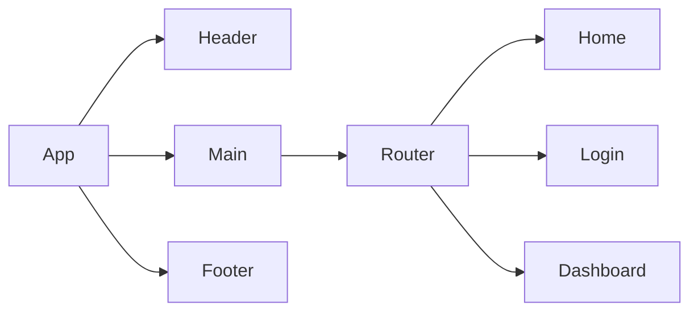

*A PRD (Product Requirements Document) is created before creating a product or feature and includes the planning required for developers to execute effectively. This document is usually prepared by Product Managers, read more [here](https://www.atlassian.com/agile/product-management/requirements)*

# Product Requirements Documentation

**Summary**
| Field | Detail |
|-------|--------|
| Project Name | Omdb movie bio flip cards|
| Description | Users click on the movie poster image film synopsis information on the reverse side |
| Developers | {Calvin Harris} |
| Live Website | {TBA} |
| Repo | https://github.com/Newbclharri/PROJECT1_WEEK5

## Problem Being Solved and Target Market

The app facilitates access of popular super hero information for fans of the genre

## User Stories

List of stories users should experience when using your application.

- Users should be able to see the site on desktop and mobile
- Users can create an account
- Users can sign in to their account
- Users can create a new item
- Users can see all their items on the dashboard
- Users can update items
- User can delete items

## Route Tables

For backend Applications you'll want to detail the different routes and types of your request your server can receive. There are three main things to define.

- The endpoint: https://www.omdbapi.com/?apikey=ad043b17&t=
- The method: GET using $.ajax()
- The response: json data

You should also include any additional notes on any special headers that may be used and so forth.

| Endpoint | Method | Response | Other |
| -------- | ------ | -------- | ----- |
| /item | GET | JSON of all items | |
| /item | POST | Create new item return JSON of new item | body must include data for new item |
| /item/:id | GET | responseJSON:
Actors: "Kristen Bell, Idina Menzel, Jonathan Groff"
Awards: "Won 2 Oscars. 82 wins & 60 nominations total"
BoxOffice: "$400,953,009"
Country: "United States"
DVD: "18 Mar 2014"
Director: "Chris Buck, Jennifer Lee"
Genre: "Animation, Adventure, Comedy"
Language: "English, Norwegian"
Metascore: "75"
Plot: "When the newly crowned Queen Elsa accidentally uses her power to turn things into ice to curse her home in infinite winter, her sister Anna teams up with a mountain man, his playful reindeer, and a snowman to change the weather condi"
Poster: "https://m.media-amazon.com/images/M/MV5BMTQ1MjQwMTE5OF5BMl5BanBnXkFtZTgwNjk3MTcyMDE@._V1_SX300.jpg"
Production: "N/A"
Rated: "PG"
Ratings: (3) [{…}, {…}, {…}]
Released: "27 Nov 2013"
Response: "True"
Runtime: "102 min"
Title: "Frozen"
Type: "movie"
Website: "N/A"
Writer: "Jennifer Lee, Hans Christian Andersen, Chris Buck"
Year: "2013"
imdbID: "tt2294629"
imdbRating: "7.5"
imdbVotes: "607,860" | |
| /item/:id | PUT | update item with matching idea, return its JSON | body must include updated data |
| /item/:id | DELETE | delete the item with the matching id | |
| /auth/signup | POST | creates new user account returns user JSON | new user info must be included in body |
| /auth/login | POST | logs in user and returns user JSON with JWT token | username and password must be included in body |

## Component Architecture

You can use the [Mermaid Markdown Syntax](https://mermaid-js.github.io/mermaid/#/flowchart) to create a chart of how the parts of your frontend website relate to each other. Units should represent components of your page. The following is an example you may see in a Single Page Application like a React App.

## User Interface Mockups

Use tooks like [Figma](https://www.figma.com/), [Mockflow](https://www.mockflow.com/) or [UXPIN](https://www.uxpin.com/). If you need inspiration visit a site like [Behance](https://www.behance.net/?tracking_source=typeahead_search_direct&search=web%20mockup). 

